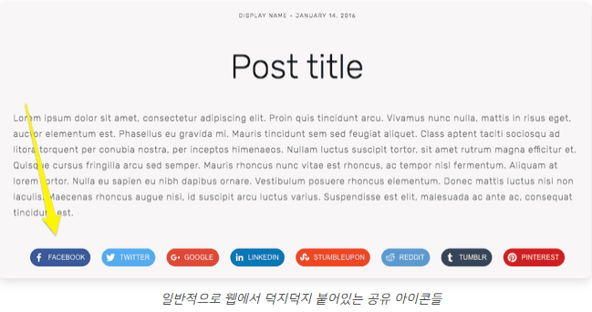
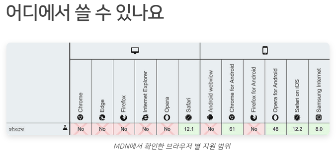

# 왜 사용하나요
Web Share API는 사용자가 선택한 임의의 대상과 텍스트, 링크 및 기타 컨텐츠를 공유하기 위해 제안된 API 로,
웹 개발자는 웹 어플리케이션 사용자에게 네이티브 환경과 동일한 공유 다이얼로그를 제공할 수 있게 됩니다.

C:\Users\net15\OneDrive\문서\mybatis-mapper\docs\WebShareAPI.md



웹 어플리케이션에서 우리는 일반적으로 URL이나 텍스트, 이미지를 다른 어플리케이션에 공유하고 싶을 때가 있습니다.
이런 상황에서 현재 우리가 취할 수 있는 행동은 다음과 같습니다.

* 페이스북이나 트위터같은 특정 서비스로의 공유 버튼을 사용하기 (문제 🙄) <br>
이 방법은 가장 일반적인 방법이지만 합리적이지 않은 부분이 있습니다. <br> 
우선 공유할 대상이 될 플랫폼이 온전히 웹 개발자에 의해 선택되고, 공유할 플랫폼 역시 페이스북이나 트위터 등 몇 개 정도로 제한되기 때문입니다. <br>

* 대부분의 모바일 브라우저단에서 지원하는 공유 기능을 활용하기 (문제 🙄) <br>
두 번째 방법 역시 몇 가지 문제가 있습니다. 공유 기능을 웹 어플리케이션 안에서 직접 컨트롤할 수 없고, <br> 
일반적으로 URL만 공유할 수 있으며, 특정한 경우에는 공유 기능을 사용하지 못 할 수도 있기 때문입니다. <br>

이러한 문제를 해결하기 위해, Web Share API 가 등장하게 되었습니다.



[__caniuse.com__](https://caniuse.com/#feat=web-share)에서 확인한 지원 범위와 차이가 있었습니다. 삼성 브라우저로 확인해 본 결과 MDN이 더 정확한 결과인듯 하여 MDN 자료를 첨부했습니다.

위의 사진에서 볼 수 있듯이 브라우저 지원 범위가 넓은 편은 아닙니다.
하지만 Web Share API를 지원하지 않는 브라우저에 대한 폴백(fallback)을 충분히 마련한다면, 사용해 볼 만한 기능입니다.

# 어떻게 쓰나요
Web Share API는 `share()` 메소드는 `window.navigator`에 포함된 내장 메소드입니다.
```js
window.navigator.share({
  title: '', // 공유될 제목
  text: '', // 공유될 설명
  url: '', // 공유될 URL
  files: [], // 공유할 파일 배열
});
```
url 프로퍼티에 빈 스트링("")을 넣으면 현재 URL이 자동으로 설정됩니다.

share()의 파라미터로 들어가는 객체는 `title, text, url, files 프로퍼티`를 가집니다. 각 프로퍼티는 `모두 옵셔널`하고, files는 File 배열 타입이며 `나머지 프로퍼티는 String 타입`을 가집니다.

`share()는 Promise 기반`으로, `사용자가 공유 액션을 성공적으로 마무리했을 때만 resolve` 됩니다. `따라서 try, catch 문을 활용하게 되면 성공과 실패 케이스를 구분`할 수 있고, 콜백 액션 역시 별도로 정의할 수 있습니다.

## 파일 공유 (NOT NEED)
```js
const shareData = {
  files: filesArray, // 파일 배열
  title: '파일 공유하기',
};

if (navigator.canShare && navigator.canShare(shareData)) {
  navigator.share(shareData);
})
```
파일을 공유하는 것은 조금 다른데, 보안 상의 이유로 공유할 수 있는 파일 타입이 제한되어 있기 때문에 위처럼 canShare() 메소드로 해당 파일 목록이 share() 메소드로 호출이 가능한지를 미리 확인하는 로직이 필요합니다.

TypeScript에서는 3.9 버전 이후부터 지원하며, 이전 버전에서 사용하고자 하는 경우에는 아래와 같이 직접 타입을 선언하여 사용할 수 있습니다.

```js
type ShareData = {
  title?: string;
  text?: string;
  url?: string;
  files?: File[];
};

interface Navigator {
  share?: (data?: ShareData) => Promise<void>;
  canShare?: (data?: ShareData) => boolean;
}
```

# 어떻게 활용하나요
아래 코드는 JavaScript에서 이벤트 리스너를 활용해 공유 버튼을 클릭하면 현재 URL을 공유하게 되는 코드입니다. 특정 버튼을 누르면 제 블로그를 공유하는 코드를 만들어볼게요.
```js
shareButton.addEventListener('click', async () => {
  try {
    await navigator.share({
      title: '재그지그의 개발 블로그',
      text: '디자인과 UI, UX에 관심이 많은 주니어 웹 프론트엔드 개발자입니다.',
      url: 'https://wormwlrm.github.io',
    });
    console.log('공유 성공');
  } catch (e) {
    console.log('공유 실패');
  }
});
```

# 주의해야 할 점
웹 개발자는 브라우저가 Web Share API를 지원하지 않는 경우에 대한 예외 처리를 해주어야 합니다.

```js
if (typeof navigator.share === 'undefined') {
  // 공유하기 버튼을 지원하지 않는 경우에 대한 폴백 처리
  shareButton.hidden = true;
}
```
그리고 보안 상의 이유로, Web Share API는 `HTTPS 환경에서만 사용 가능`하며 `사용자의 직접적인 액션으로만 호출할 수 있습니다.` 즉, onload 같은 `콜백 함수에서는 호출할 수 없습니다.`


# 실습
`https://codepen.io/ayoisaiah/pen/WBpzBo`

```js
<div class="share-dialog">
  <header>
    <h3 class="dialog-title">Share this pen</h3>
    <button class="close-button"><svg><use href="#close"></use></svg></button>
  </header>
  <div class="targets">
    <a class="button">
      <svg>
        <use href="#facebook"></use>
      </svg>
      <span>Facebook</span>
    </a>
    
    <a class="button">
      <svg>
        <use href="#twitter"></use>
      </svg>
      <span>Twitter</span>
    </a>
    
    <a class="button">
      <svg>
        <use href="#linkedin"></use>
      </svg>
      <span>LinkedIn</span>
    </a>
    
    <a class="button">
      <svg>
        <use href="#email"></use>
      </svg>
      <span>Email</span>
    </a>
  </div>
  <div class="link">
    <div class="pen-url">https://codepen.io/ayoisaiah/pen/YbNazJ</div>
    <button class="copy-link">Copy Link</button>
  </div>
</div>

<button class="share-button" type="button" title="Share this article">
  <svg>
    <use href="#share-icon"></use>
  </svg>
  <span>Share</span>
</button>

<svg class="hidden">
  <defs>
    <symbol id="share-icon" viewBox="0 0 24 24" fill="none" stroke="currentColor" stroke-width="2" stroke-linecap="round" stroke-linejoin="round" class="feather feather-share"><path d="M4 12v8a2 2 0 0 0 2 2h12a2 2 0 0 0 2-2v-8"></path><polyline points="16 6 12 2 8 6"></polyline><line x1="12" y1="2" x2="12" y2="15"></line></symbol>
    
    <symbol id="facebook" viewBox="0 0 24 24" fill="#3b5998" stroke="#3b5998" stroke-width="2" stroke-linecap="round" stroke-linejoin="round" class="feather feather-facebook"><path d="M18 2h-3a5 5 0 0 0-5 5v3H7v4h3v8h4v-8h3l1-4h-4V7a1 1 0 0 1 1-1h3z"></path></symbol>
    
    <symbol id="twitter" viewBox="0 0 24 24" fill="#1da1f2" stroke="#1da1f2" stroke-width="2" stroke-linecap="round" stroke-linejoin="round" class="feather feather-twitter"><path d="M23 3a10.9 10.9 0 0 1-3.14 1.53 4.48 4.48 0 0 0-7.86 3v1A10.66 10.66 0 0 1 3 4s-4 9 5 13a11.64 11.64 0 0 1-7 2c9 5 20 0 20-11.5a4.5 4.5 0 0 0-.08-.83A7.72 7.72 0 0 0 23 3z"></path></symbol>
    
    <symbol id="email" viewBox="0 0 24 24" fill="#777" stroke="#fafafa" stroke-width="2" stroke-linecap="round" stroke-linejoin="round" class="feather feather-mail"><path d="M4 4h16c1.1 0 2 .9 2 2v12c0 1.1-.9 2-2 2H4c-1.1 0-2-.9-2-2V6c0-1.1.9-2 2-2z"></path><polyline points="22,6 12,13 2,6"></polyline></symbol>
    
    <symbol id="linkedin" viewBox="0 0 24 24" fill="#0077B5" stroke="#0077B5" stroke-width="2" stroke-linecap="round" stroke-linejoin="round" class="feather feather-linkedin"><path d="M16 8a6 6 0 0 1 6 6v7h-4v-7a2 2 0 0 0-2-2 2 2 0 0 0-2 2v7h-4v-7a6 6 0 0 1 6-6z"></path><rect x="2" y="9" width="4" height="12"></rect><circle cx="4" cy="4" r="2"></circle></symbol>
    
    <symbol id="close" viewBox="0 0 24 24" fill="none" stroke="currentColor" stroke-width="2" stroke-linecap="round" stroke-linejoin="round" class="feather feather-x-square"><rect x="3" y="3" width="18" height="18" rx="2" ry="2"></rect><line x1="9" y1="9" x2="15" y2="15"></line><line x1="15" y1="9" x2="9" y2="15"></line></symbol>
  </defs>
</svg>

html {
  box-sizing: border-box;
}

*, *::before, *::after {
  box-sizing: inherit;
  padding: 0;
  margin: 0;
}

body {
  font-family: -apple-system,BlinkMacSystemFont,San Francisco,Helvetica Neue,Helvetica,Ubuntu,Roboto,Noto,Segoe UI,Arial,sans-serif;
}

.hidden {
  display: none;
}

svg {
  width: 20px;
  height: 20px;
  margin-right: 7px;
}

button, .button {
  display: inline-flex;
  align-items: center;
  justify-content: center;
  height: auto;
  padding-top: 8px;
  padding-bottom: 8px;
  color: #777;
  text-align: center;
  font-size: 14px;
  font-weight: 500;
  line-height: 1.1;
  letter-spacing: 2px;
  text-transform: capitalize;
  text-decoration: none;
  white-space: nowrap;
  border-radius: 4px;
  border: 1px solid #ddd;
  cursor: pointer;
}

button:hover, .button:hover {
  border-color: #cdd;
}

.share-button, .copy-link {
  padding-left: 30px;
  padding-right: 30px;
}

.share-button, .share-dialog {
  position: absolute;
  top: 50%;
  left: 50%;
  transform: translate(-50%, -50%);
}

.share-dialog {
  display: none;
  width: 95%;
  max-width: 500px;
  box-shadow: 0 8px 16px rgba(0,0,0,.15);
  z-index: -1;
  border: 1px solid #ddd;
  padding: 20px;
  border-radius: 4px;
  background-color: #fff;
}

.share-dialog.is-open {
  display: block;
  z-index: 2;
}

header {
  display: flex;
  justify-content: space-between;
  margin-bottom: 20px;
}

.targets {
  display: grid;
  grid-template-rows: 1fr 1fr;
  grid-template-columns: 1fr 1fr;
  grid-gap: 20px;
  margin-bottom: 20px;
}

.close-button {
  background-color: transparent;
  border: none;
  padding: 0;
}

.close-button svg {
  margin-right: 0;
}

.link {
  display: flex;
  justify-content: center;
  align-items: center;
  padding: 10px;
  border-radius: 4px;
  background-color: #eee;
}

.pen-url {
  margin-right: 15px;
  overflow: hidden;
  text-overflow: ellipsis;
  white-space: nowrap;
}

const shareButton = document.querySelector('.share-button');
const shareDialog = document.querySelector('.share-dialog');
const closeButton = document.querySelector('.close-button');

shareButton.addEventListener('click', async () => {
  try {
    await navigator.share({
      title: '재그지그의 개발 블로그',
      text: '디자인과 UI, UX에 관심이 많은 주니어 웹 프론트엔드 개발자입니다.',
      url: 'https://wormwlrm.github.io',
    });
    console.log('공유 성공');
  } catch (e) {
    console.log('공유 실패');
  }
});
```