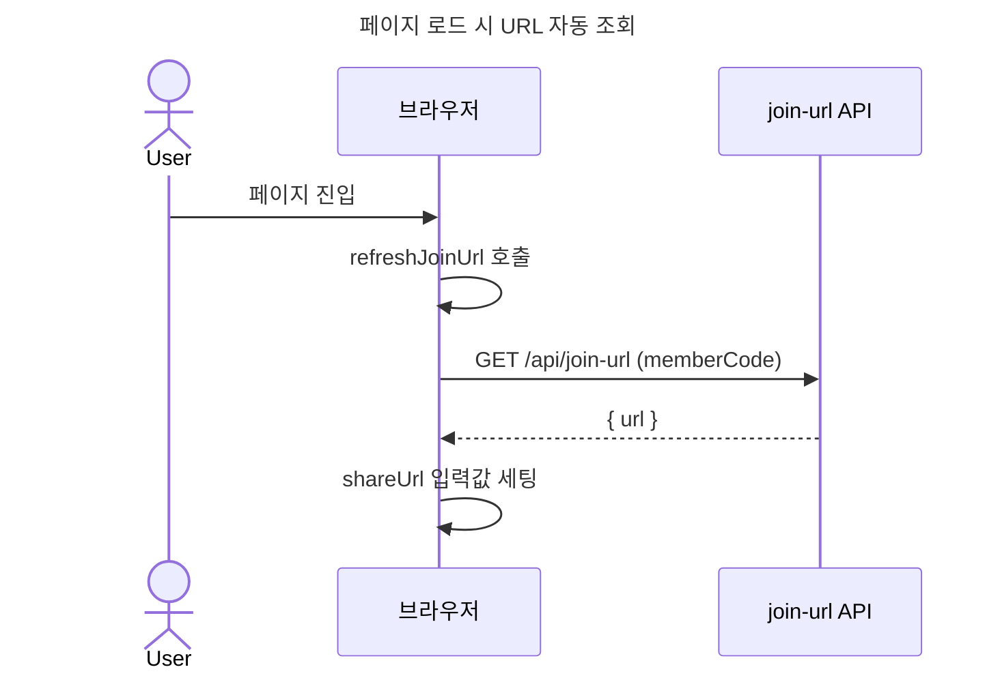
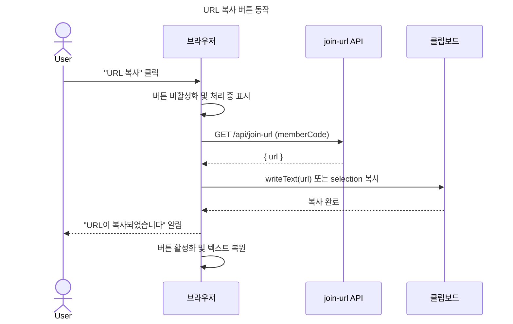
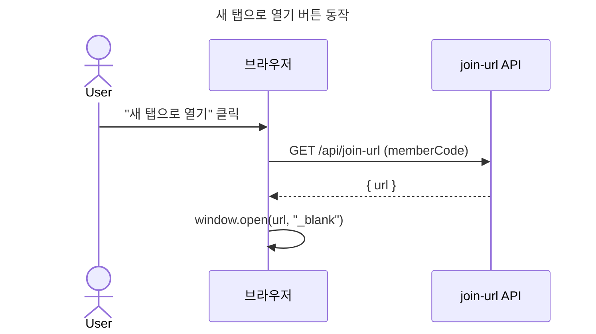
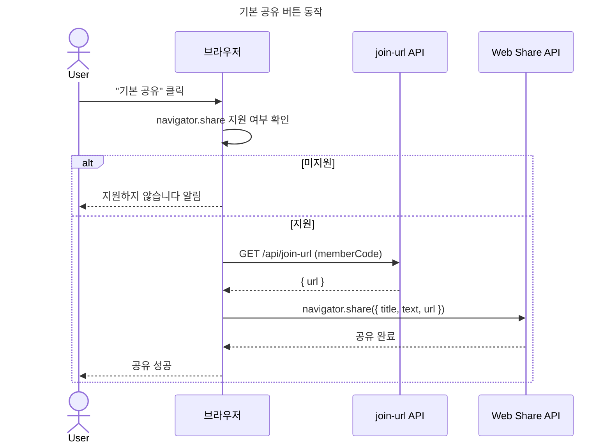

# 추천인 URL 화면 시퀀스 다이어그램

이 문서는 `recommend.jsp`의 동작 흐름을 Mermaid 시퀀스 다이어그램으로 정리합니다.

## 페이지 진입 시 URL 자동 조회

```mermaid
sequenceDiagram
    actor User
    participant Browser as 브라우저
    participant API as join-url API
    title 페이지 로드 시 URL 자동 조회
    User ->> Browser: 페이지 진입
    Browser ->> Browser: refreshJoinUrl 호출
    Browser ->> API: GET /api/join-url (memberCode)
    API -->> Browser: { url }
    Browser ->> Browser: shareUrl 입력값 세팅
```

## 추천인 코드 입력 시 URL 갱신

```mermaid
sequenceDiagram
    actor User
    participant Browser as 브라우저
    participant API as join-url API
    title 추천인 코드 입력 시 URL 갱신
    User ->> Browser: 추천인 코드 입력
    Browser ->> Browser: refreshJoinUrl 호출
    Browser ->> API: GET /api/join-url (memberCode)
    API -->> Browser: { url }
    Browser ->> Browser: shareUrl 입력값 세팅
```

## URL 복사 버튼

```mermaid
sequenceDiagram
    actor User
    participant Browser as 브라우저
    participant API as join-url API
    participant Clipboard as 클립보드
    title URL 복사 버튼 동작
    User ->> Browser: "URL 복사" 클릭
    Browser ->> Browser: 버튼 비활성화 및 처리 중 표시
    Browser ->> API: GET /api/join-url (memberCode)
    API -->> Browser: { url }
    Browser ->> Clipboard: writeText(url) 또는 selection 복사
    Clipboard -->> Browser: 복사 완료
    Browser -->> User: "URL이 복사되었습니다" 알림
    Browser ->> Browser: 버튼 활성화 및 텍스트 복원
```

## 새 탭으로 열기 버튼

```mermaid
sequenceDiagram
    actor User
    participant Browser as 브라우저
    participant API as join-url API
    title 새 탭으로 열기 버튼 동작
    User ->> Browser: "새 탭으로 열기" 클릭
    Browser ->> API: GET /api/join-url (memberCode)
    API -->> Browser: { url }
    Browser ->> Browser: window.open(url, "_blank")
```

## 기본 공유 버튼

```mermaid
sequenceDiagram
    actor User
    participant Browser as 브라우저
    participant API as join-url API
    participant Share as Web Share API
    title 기본 공유 버튼 동작
    User ->> Browser: "기본 공유" 클릭
    Browser ->> Browser: navigator.share 지원 여부 확인
    alt 미지원
        Browser -->> User: 지원하지 않습니다 알림
    else 지원
        Browser ->> API: GET /api/join-url (memberCode)
        API -->> Browser: { url }
        Browser ->> Share: navigator.share({ title, text, url })
        Share -->> Browser: 공유 완료
        Browser -->> User: 공유 성공
    end
```
